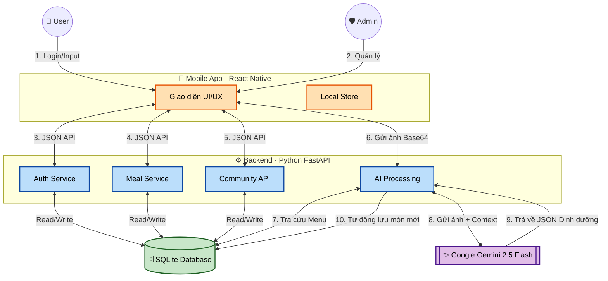
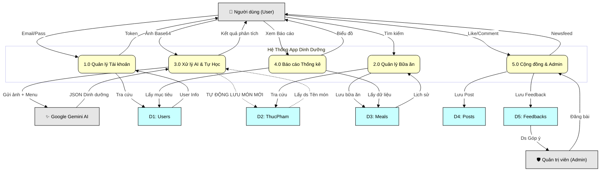

# Ứng dụng Quản lý Dinh dưỡng Cá nhân AI (Smart Nutrition Tracker)

## 1. Giới thiệu Dự án

Ứng dụng **Smart Nutrition Tracker** là giải pháp Fullstack di động (Mobile App) được phát triển nhằm mục đích theo dõi dinh dưỡng cá nhân một cách thông minh và tiện lợi. Hệ thống này sử dụng trí tuệ nhân tạo để nhận diện và phân tích món ăn, đồng thời cung cấp các công cụ quản lý hồ sơ sức khỏe và mục tiêu chi tiết.

### Công nghệ cốt lõi
* **Frontend:** React Native (Expo) - Giao diện di động mượt mà.
* **Backend:** Python (FastAPI) - API hiệu năng cao, xử lý logic phức tạp.
* **Database:** SQLite (SQLAlchemy ORM) - Cơ sở dữ liệu nội bộ.
* **AI Engine:** Google Gemini 2.5 Flash - Xử lý Thị giác (Vision) và Ngôn ngữ (Chat).

---

## 2. Cài đặt và Kiểm thử

### 2.1 Yêu cầu cấu hình cài đặt ứng dụng

| Loại | Thành phần | Chi tiết / Đề xuất |
| :--- | :--- | :--- |
| **Phần cứng** | CPU / RAM | Tối thiểu 4GB RAM, CPU Dual-Core (Cấu hình PC phát triển cơ bản). |
| | Thiết bị | Điện thoại Android/iOS (chạy ứng dụng **Expo Go**) hoặc Android Emulator/Simulator. |
| **Phần mềm** | Python | **Python 3.10** trở lên. |
| | Node.js | **Node.js 16.x** trở lên và **npm** (hoặc Yarn). |
| | Expo CLI | Cài đặt toàn cục: `npm install -g expo-cli` |
| | DB Tool | **DB Browser for SQLite** (Để xem dữ liệu). |
| **Thư viện chính** | Backend | `fastapi`, `uvicorn`, `google-generativeai`, `sqlalchemy`, `python-dotenv`. |
| | Frontend | `expo-router`, `zustand`, `react-native-chart-kit`, `expo-linear-gradient`. |

### 2.2 Biến môi trường & file cấu hình mẫu

Để bảo mật, API Key của Google Gemini được lưu trong file `.env`.

* **File `.env`** (Đặt tại thư mục `BE`):
    ```env
    GEMINI_API_KEY=AIzaSyB... (Dán Key mới nhất của bạn vào đây)
    ```
* **File `src/constants/ApiConfig.ts`** (Frontend):
    ```typescript
    export const API_URL = '[http://192.168.1.xxx:8000](http://192.168.1.xxx:8000)'; // Thay bằng IP local máy bạn
    ```

### 2.3 Hướng dẫn cài đặt nhanh (Local Setup)

| STT | Mô tả | Lệnh thực hiện |
| :--- | :--- | :--- |
| **A1** | Cài đặt môi trường Python | `cd BE` <br> `pip install -r requirements.txt` (Hoặc liệt kê các thư viện) |
| **A2** | Khởi tạo Database & Dữ liệu gốc | `python setup_db.py` <br> `python seed_1000.py` (Tùy chọn, để có 1000+ món ăn) |
| **A3** | **Khởi động Backend API** | `python -m uvicorn main:app --reload --host 0.0.0.0` |
| **F1** | Cài đặt Dependencies JS | `cd FE` <br> `npm install` |
| **F2** | **Khởi động Frontend (App)** | `npx expo start` |
| **F3** | Kiểm tra kết nối | Mở trình duyệt trên điện thoại/máy ảo, truy cập: <br> **`http://192.168.1.xxx:8000/docs`** |

### 2.4 Kiểm thử chức năng cốt lõi

| STT | Chức năng | Hành động kiểm thử | Kết quả mong muốn |
| :--- | :--- | :--- | :--- |
| **T1** | **Đăng ký (UC1)** | Trang Đăng ký > Nhập info > Save | Server trả về `200 OK`, User mới được tạo trong bảng `users`. |
| **T2** | **Đăng nhập (UC2)** | Login bằng tài khoản vừa tạo. | Server trả về `User ID` và `Token`, App chuyển sang trang chủ. |
| **T3** | **AI Scan (UC9)** | Trang *Meal Log* > Chụp ảnh > Phân tích. | Server trả về **JSON** dinh dưỡng, **Lưu món mới** vào bảng `ThucPham`. |
| **T4** | **Lịch sử (UC7/UC10)** | Trang *Home* > Xem chỉ số Calo/Macro. | Biểu đồ Pie Chart hiển thị dữ liệu thật vừa ăn, không phải số 0. |

---

## 3. Giới thiệu giao diện chương trình (Showcase)

### 3.1 Giao diện Trang Chủ & Water Tracker
* **Mục tiêu:** Cung cấp tổng quan về tiến độ Calo Nạp vào so với Mục tiêu (TDEE).
* **Chức năng chính:**
    * Hiển thị **Biểu đồ tròn (Pie Chart)** phân bổ Macros (Đạm, Carb, Béo) trong ngày.
    * Hiển thị **Water Tracker** (Theo dõi uống nước) với 8 ly nước, bấm để tương tác.
    * Truy cập nhanh đến các tính năng khác (Quét AI, Báo cáo).

### 3.2 Giao diện Ghi nhận bữa ăn (AI Log)
* **Mục tiêu:** Đơn giản hóa việc ghi nhận dinh dưỡng và loại bỏ lỗi "nhập tay".
* **Chức năng chính:**
    * **Quét ảnh AI (Gemini 2.5 Flash):** Nhận diện món ăn, ước tính dinh dưỡng và tự động lưu vào **Cơ sở dữ liệu tự học (Auto-Learning DB)** nếu món đó là món mới.
    * **Nhập thủ công thông minh:** Người dùng nhập tên món ăn, App gợi ý từ 1200+ món trong DB. Chọn món, nhập **Khẩu phần/Số lượng**, và App tự động tính tổng Calo/Macros.

### 3.3 Giao diện Hồ sơ & Mục tiêu
* **Mục tiêu:** Quản lý sức khỏe cá nhân và đồng bộ hóa dữ liệu hai chiều (FE <-> BE).
* **Chức năng chính:**
    * Hiển thị **Avatar động** (tạo theo tên) và **Đánh giá BMI** (Gầy, Chuẩn, Béo phì) bằng màu sắc cảnh báo.
    * Cập nhật Chiều cao/Cân nặng/Tuổi: Server tự động tính toán lại **Mục tiêu Calo (TDEE)** và lưu vào Database.
    * Quản lý Dị ứng: Lưu danh sách dị ứng vào Server để các tính năng gợi ý sau này có thể tránh món đó.

### 3.4 Giao diện Báo cáo Thống kê
* **Mục tiêu:** Phân tích dữ liệu lịch sử để đưa ra nhận xét chuyên sâu.
* **Chức năng chính:**
    * **Biểu đồ Cột/Tròn:** Xem tổng Calo nạp vào so với Mục tiêu theo khoảng thời gian tùy chọn (Ngày/Tuần/Tháng).
    * **Phân tích AI:** Gửi dữ liệu lịch sử ăn uống lên Gemini để nhận **Đánh giá tổng quan, Gợi ý cải thiện, Nhắc nhở động lực** (dạng 3 đoạn văn chuyên nghiệp).

graph TD
    %% Định nghĩa các Style
    classDef mobile fill:#f9f,stroke:#333,stroke-width:2px,color:black;
    classDef backend fill:#bbf,stroke:#333,stroke-width:2px,color:black;
    classDef db fill:#bfb,stroke:#333,stroke-width:2px,color:black;
    classDef ai fill:#fbb,stroke:#333,stroke-width:2px,color:black;



---

## 4. Kết luận

Dự án đã triển khai thành công mô hình **Fullstack & AI Tích hợp**, vượt qua các thách thức kỹ thuật như bảo mật Key API, xử lý lỗi Database, và tạo ra trải nghiệm người dùng hiện đại, có tính cá nhân hóa cao. Hệ thống đã sẵn sàng để trình bày và triển khai.
